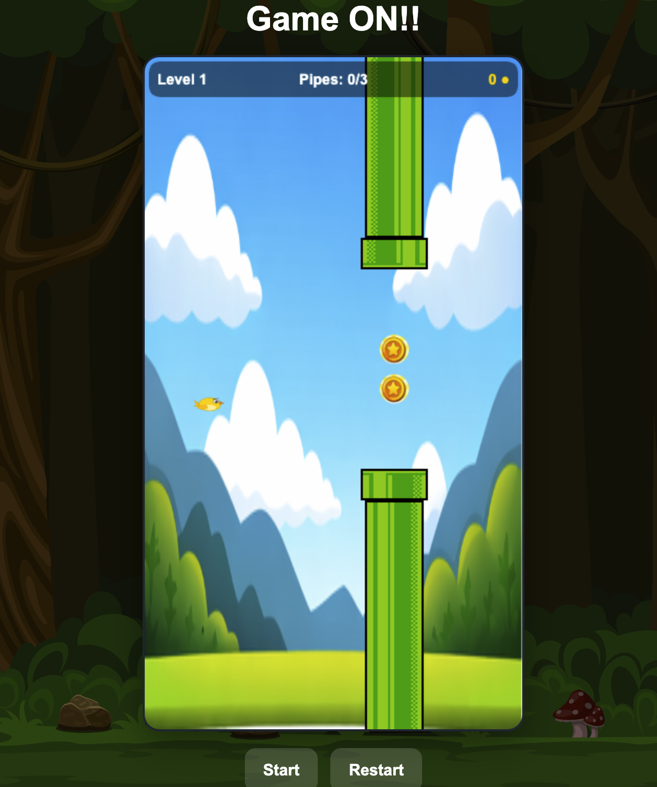
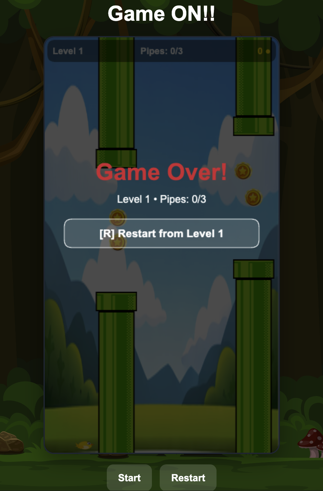
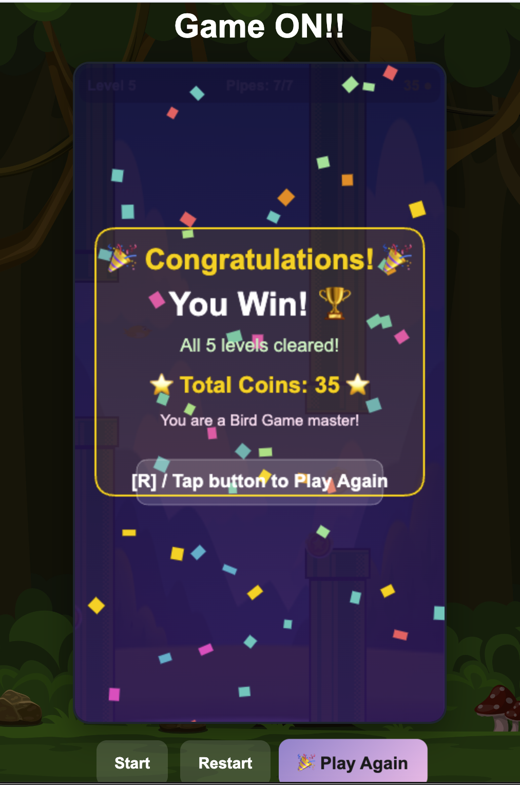

# 🐦 Game ON!! — Flying Bird Game

A browser-based 2D Flying Bird Game built with **Vue 3** and the **HTML5 Canvas API**. Navigate your bird through pipe obstacles across 5 progressively challenging levels, collect coins, and aim for the win screen!

🎮 **[Play the game live](https://ammun99.github.io/bird-game-page/)**

---

## 📸 Screenshots

| Gameplay | Game Over | Victory |
|----------|-----------|---------|
|  |  |  |

> _Replace the image paths above with your actual screenshot assets if needed._

---

## ✨ Features

- 🏆 **5 Progressive Levels** — Speed increases, gaps narrow, and more pipes to survive each level
- 🪙 **Coin Collection System** — Collect coins mid-flight; they carry over across all levels
- 💀 **Continue Mechanic** — Spend coins to continue from the current level after a game over (Level 2+)
- 🎵 **Sound & Music** — Background music, coin collect, game over, and win sound effects
- 🎊 **Confetti Win Screen** — Animated particle celebration when you clear all 5 levels
- 📱 **Mobile Friendly** — Full touch/tap support alongside keyboard controls
- 🕊️ **Hover Animation** — Smooth sine-wave idle animation before the game starts
- 📊 **Live HUD** — Real-time display of level, pipes passed, and coin count

---

## 🎮 Controls

| Action | Keyboard | Mobile |
|--------|----------|--------|
| Flap / Jump | `Space` | Tap screen |
| Restart game | `R` | Restart button |
| Continue (spend coins) | `C` | Continue button |

---

## 🗺️ Level Design

| Level | Difficulty | Pipe Gap | Speed | Pipe Pairs | Min Coins |
|-------|------------|----------|-------|------------|-----------|
| 1 | Beginner | 190 px | 2.2 | 3 | 4 |
| 2 | Easy | 175 px | 2.5 | 4 | 6 |
| 3 | Medium | 160 px | 2.8 | 5 | 8 |
| 4 | Hard | 145 px | 3.1 | 6 | 10 |
| 5 | Expert | 130 px | 3.4 | 7 | 12 |

---

## 🛠️ Tech Stack

| Layer | Technology |
|-------|-----------|
| Framework | Vue 3 (Composition API, `<script setup>`) |
| Rendering | HTML5 Canvas 2D |
| Animation | `requestAnimationFrame` with delta-time game loop |
| Audio | Web Audio API |
| Build Tool | Vite 8 |
| Routing | Vue Router 5 |
| Deployment | GitHub Pages (`gh-pages`) |

---

## 🚀 Getting Started

### Prerequisites

- Node.js 18 or higher
- npm

### Installation

```bash
# Clone the repository
git clone https://github.com/ammun99/bird-game-page.git
cd bird-game-page

# Install dependencies
npm install

# Start the development server
npm run dev
```

Open your browser at `http://localhost:5173` to play locally.

### Build for Production

```bash
npm run build
```

### Deploy to GitHub Pages

```bash
npm run build
npx gh-pages -d dist
```

---

## 📁 Project Structure

```
bird-game-page/
├── public/                 # Static assets served as-is
├── src/
│   ├── assets/             # Images and audio files
│   │   ├── bg.png          # Background image
│   │   ├── bird.png        # Bird sprite
│   │   ├── pipe.png        # Pipe body sprite
│   │   ├── pipe_up.png     # Pipe cap sprite
│   │   ├── coin.png        # Coin sprite
│   │   ├── background_music.wav
│   │   ├── coin_collect.wav
│   │   ├── game_over.wav
│   │   └── win.wav
│   ├── components/
│   │   └── FlappyBirdGame.vue   # Main game component (926 lines)
│   └── main.js
├── index.html
├── vite.config.js
└── package.json
```

---

## ⚙️ How It Works

The game runs a **delta-time driven `requestAnimationFrame` loop**. Each frame:

1. Physics are updated — gravity pulls the bird down, flap input pushes it up
2. Pipes spawn on a millisecond accumulator timer
3. All objects move left across the canvas
4. Collision detection checks for pipe hits and coin overlaps
5. The canvas is cleared and all sprites are redrawn
6. The HUD is drawn on top
7. State transitions are evaluated (level complete, game over, winner)

**Physics constants:**

| Property | Value |
|----------|-------|
| Gravity | 0.35 px/frame² |
| Flap velocity | 6.0 px/frame upward |
| Terminal velocity | 8.0 px/frame downward |
| Hover amplitude | 7.0 px sinusoidal (idle) |
| Bird size | 34 × 24 px |
| Pipe width | 64 px |
| Canvas size | 360 × 640 px |

---

## 📄 Presentation

A full project presentation is included in the repository: [`BirdGame_Presentation.pdf`](./BirdGame_Presentation.pdf)

---

> Built with ❤️ using Vue 3 + Vite
